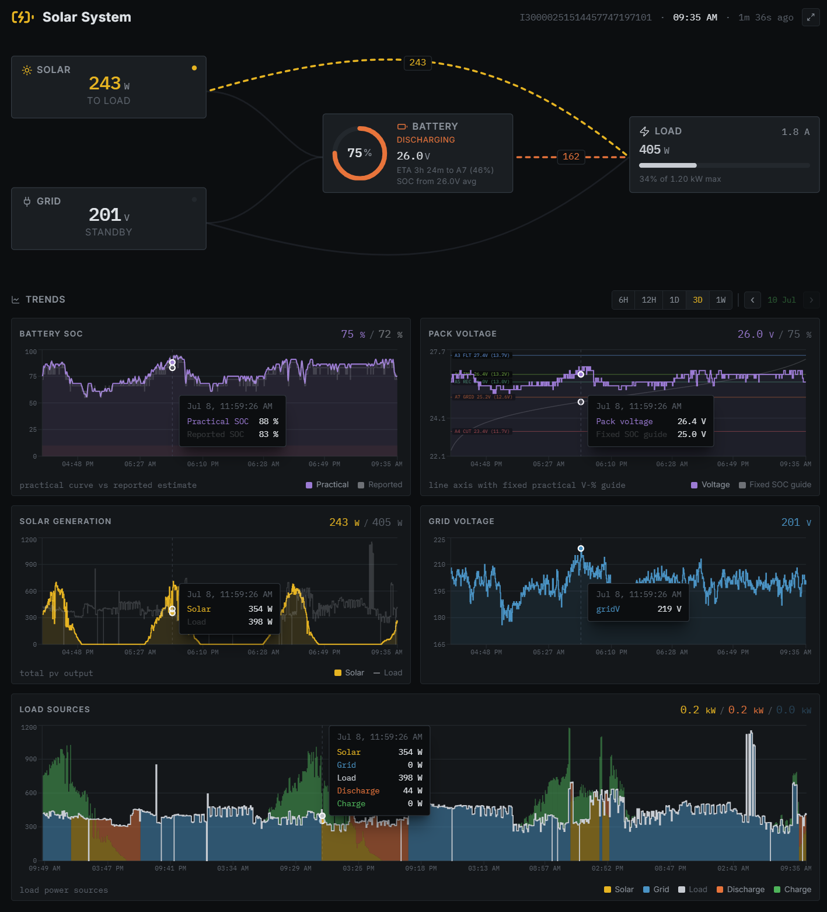

# Solar Monitoring

Self-hosted solar monitoring and inverter-control dashboard built around DESSMonitor telemetry.



Public live demo is intentionally not exposed; I share a private deployed instance during walkthroughs.

## Why this project exists

This project powers a real home setup where stable battery behavior matters. It combines live telemetry, practical battery state estimation, and guarded control automation in a single interface.

## Standout features

- DESSMonitor API integration with signed requests, session handling, and background polling.
- Real-time energy flow view for solar, grid, load, battery charge, and battery discharge.
- Practical SOC model based on voltage behavior, not only the inverter-reported SOC.
- Historical analytics (battery SOC, voltage, generation, load, and source breakdown).
- Control center for inverter parameters with write guards, validation, and audit logs.
- Automation engine that adjusts thresholds based on schedule and operating context.

## Tech stack

- React 18 + Vite + Tailwind CSS + Recharts
- TypeScript across frontend and server runtime
- sql.js (SQLite in-process storage)
- Node.js backend + poller services

## Local setup

### Prerequisites

- Node.js 20 or newer
- pnpm

### Start locally

```bash
cp .env.example .env
cd app
pnpm install
pnpm dev
```

Then open `http://127.0.0.1:43872`.

## Deployment and security notes

- This is intended for self-hosted deployments.
- Keep the API bound to localhost and front it with an authenticated reverse proxy.
- For private internet access, use an access layer such as Cloudflare Access.
- Do not expose write/control endpoints directly to the public internet.

## Repository layout

- `app/`: frontend, API server, poller, automation, and shared logic
- `docs/`: reverse-engineering notes, tuning plans, and reference docs
- `scripts/`: deployment automation scripts

## Additional docs

See `docs/README.md` for deeper implementation notes and references.

## License

MIT. See `LICENSE`.
