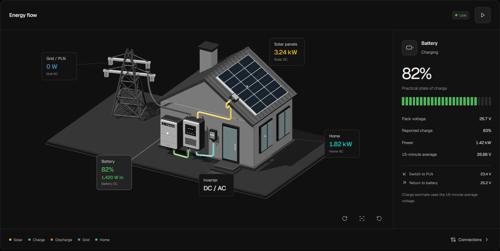

# Solar Monitoring

Self-hosted home energy monitoring and inverter controls, built around DESSMonitor telemetry. One scrolling dashboard combines a connected 3D installation, historical charts, daily energy totals, and device settings.



The screenshot uses synthetic telemetry. The deployed instance is private.

## Dashboard

- A Three.js house installation with roof panels, a wall-mounted battery and inverter, and a PLN grid tower. Physical cables carry moving light streaks to show flow direction. Select a device for its readings.
- Neutral dark backgrounds with saturated energy colors. Layouts adapt to phones and desktops, with camera presets, a pause control, reduced-motion support, and a fallback when WebGL is unavailable.
- Battery charge and watts in or out appear directly in the scene. Shared API and frontend calculations infer missing power where the readings support it. Estimates use `≈`, known minimums use `≥`, and unresolved readings stay unmetered. Estimates exclude conversion losses.
- A Jakarta clock and update age stay visible. Delayed readings retain their last known animated flow and are marked as delayed or offline.
- Historical SOC, voltage, generation, load, and source charts, plus daily energy totals. Charts and daily energy share date navigation. The Energy sources chart uses a white load line over its colored areas.
- Practical battery SOC uses a voltage curve and a 15-minute average alongside the inverter-reported SOC. Controls include validation, write confirmation, verification, and audit history. Automation can adjust thresholds by schedule and operating conditions.

## Backend

- Signed DESSMonitor requests, session handling, and a separate background poller.
- SQLite storage through `better-sqlite3`, with WAL transactions, validated backups, and graceful shutdown.
- A readiness endpoint that checks database access and telemetry age.

## Tech stack

- React 18, Vite 6, Tailwind CSS 4, Three.js, Recharts, and TanStack Query
- TypeScript across frontend and server runtime
- SQLite through `better-sqlite3`
- Node.js backend + poller services

## Local setup

### Prerequisites

- Node.js 22 or newer, as specified in `.nvmrc`
- pnpm

### Start locally

```bash
cp .env.example .env
```

Fill in the DESSMonitor credentials and device identifiers in `.env`, then start the app:

```bash
cd app
pnpm install --frozen-lockfile
pnpm dev
```

Open `http://127.0.0.1:43872`. This starts the UI, API, and poller. The API listens on `127.0.0.1:43871`; databases live under `data/` by default.

For UI work against an existing API, set `DESS_DEV_API_TARGET` and run `pnpm dev:ui`. The `.env.example` file also documents the SSH tunnel helper used by `pnpm dev:ui:vps`.

## Verification

From `app/`:

```bash
pnpm build
pnpm test
pnpm test:frontend
pnpm exec playwright install chromium
pnpm test:ui
```

Browser tests use a local fixture API with synthetic telemetry. Control-write responses are mocked and never reach an inverter. Coverage includes camera dragging, flow animation, delayed data and recovery, responsive layouts, historical dates, and control drafts. The installation screenshot is generated at `app/test-results/installation.png`.

## Deployment and security notes

- Keep the API bound to localhost and front it with an authenticated reverse proxy.
- For private internet access, use an access layer such as Cloudflare Access.
- Do not expose write/control endpoints directly to the public internet.
- Keep `.env`, databases, and local deployment notes out of Git and source uploads.

The deployment and operations scripts target this project's shared VPS. Review their target checks before adapting them to another host. See [production safety](docs/production-safety.md) for readiness checks, backups, and recovery procedures.

## Repository layout

- `app/`: frontend, API server, poller, automation, and shared logic
- `docs/`: reverse-engineering notes, tuning plans, and reference docs
- `scripts/`: deployment automation scripts
- `ops/`: Solar service overrides and database backup units

## Additional docs

See the [documentation index](docs/README.md), [interface design](docs/interface-design.md), and [DESSMonitor API notes](docs/dessmonitor-api-endpoints.md).

## License

MIT. See [LICENSE](LICENSE).
